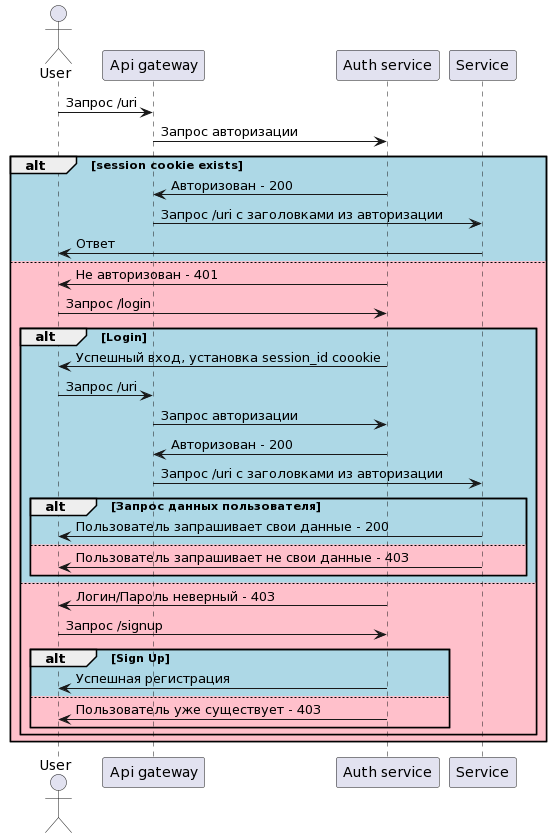

# Api gateway (NGINX)
Запустить кластер в minilube:
```shell
minikube start --cpus=4 --memory=4000m
```
Активировать addon Ingress:
```shell 
minikube addons enable ingress
```

Установить User API :
```shell 
helm install api app/user-api/user-api-app-chart/
```

Установить Auth Service:
```shell 
helm install auth app/auth-service/user-api-auth-chart/
```

Запустить тесты Postman через Newman:
```shell 
newman run user-api-auth-test-collection.json -e environment-vars.json
```

# Архитектура решения
